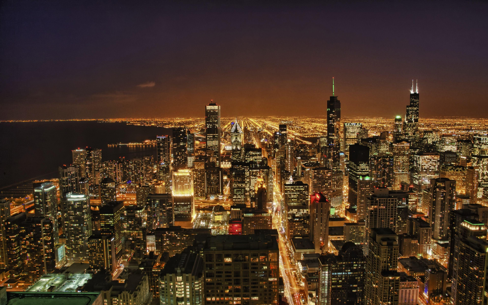
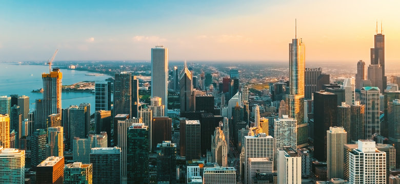

# PixelMorph

Transforms one image into another by rearranging pixels and outputting a transition video.

## Features
- Computes a brightness-based pixel mapping between two images.
- Interpolates pixel positions to generate a smooth transition.
- Produces an MP4 video (mp4v codec) showing the transformation.
- Utilizes multithreading to speed up video frame generation for faster processing on multi-core CPUs.
- Simple single-file script (`pixelmorph.py`).

## Example

| **Starting Image** | **Target Image** |
|:------------------:|:----------------:|
|  |  |


### Transformation Video Preview

https://github.com/user-attachments/assets/565dd2ef-45c4-43ae-b01a-57a028d65472


## Requirements
- Python 3.8+
- numpy
- opencv-python

Install dependencies:
```
pip install numpy opencv-python
```

## Usage
From the repository root (Windows CMD / PowerShell):

```
python pixelmorph.py <source_image> <target_image> <output_video.mp4>
```

Example:
```
python pixelmorph.py .\images\source.jpg .\images\target.jpg video.mp4
```

## Notes
- Images will be resized to fit a square canvas (default MAX_SIZE = 512) while preserving aspect ratio and centered with black padding.
- The script uses luminance sorting to create a pixel mapping; this produces visually pleasing results but is not a semantic pixel correspondence.
- Video parameters (steps, fps, hold duration) are set in `create_transition_video` and can be adjusted in the script for speed/quality tradeoffs. The main invocation currently uses 300 steps and 30 fps.
- Large sizes greatly increase memory and CPU usage; reduce MAX_SIZE or steps if you run into resource limits or it just takes too long.
- **Multithreading:** Frame generation for the transition video is parallelized using Python's `concurrent.futures.ThreadPoolExecutor`, which can significantly reduce processing time on systems with multiple CPU cores. You can control the number of worker threads by passing the `workers` argument to `create_transition_video`.

## Limitations
- No GUI; command-line usage only.
- Mapping is based on brightness ordering and will not preserve object structure.
- Some pixels may collide during interpolation; the implementation places pixels in integer coordinates which can cause overwrites.

## License
See [License](LICENSE)
